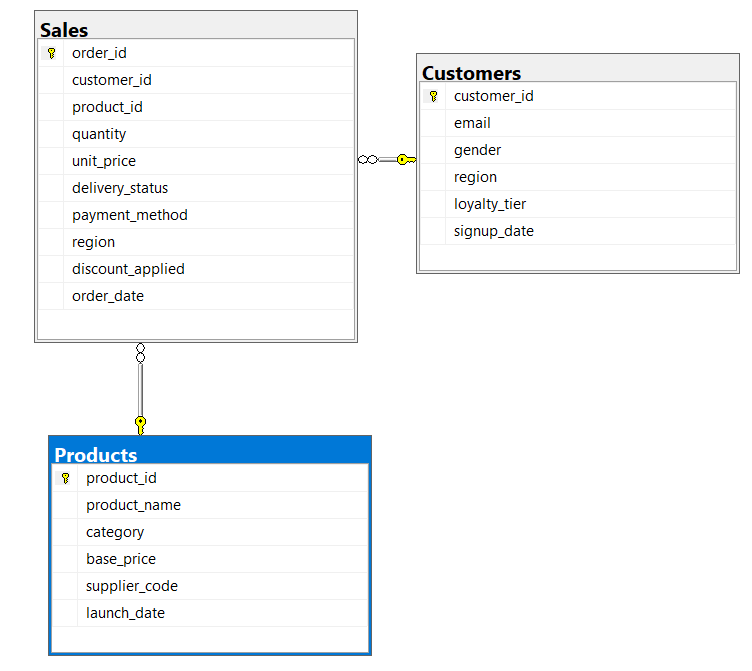

# Retail Sales Analysis

## 1.Project Overview
This project analyzes retail sales data to understand customer behavior, product performance and overall sales performance.
The main goal is to transform raw data into structured and meaningful business insights.

## 2.Dataset
The dataset contains three main tables:
- **Customers**- information about customers such as: gender, region, loyalty tier, email and signup date.
- **Products**- information about products such as:
product name, category, base price, supplier code and launch date. 
- **Sales**- information about sales such as: quantity, unit price, discount, payment method, delivery status and order date.

## 3.Database Schema
The table `Sales` connects `Customers` and `Products` through foreign keys.

## 4.Data Exploration
The initial exploration focused on understanding table structure and columns, missing values or records and potential primary and foreign key relationships.

## 5.Data Cleaning
The raw dataset contained several data quality issues that were addressed before performing the analysis.
The main cleaning steps included:
- removing records with missing primary key;
- removing duplicate orders;
- removing invalid foreign key references;
- standardizing categorical values;
- identifying and removing invalid values;
- handling missing values;
- converting columns to appropriate data types;
- creating primary key constraints and foreign key constraints;

The detailed cleaning process can be found in: `SQL/02.Data_Cleaning.sql`

## 6.Data Analysis
The analysis was divided into three main areas:
### Descriptive Analysis
- Used to understand the overall structure and distribution of the data. This included customers and product distribution,payment methods, delivery statuses and discount usage.

### Comparative analysis
- Used to compare customer, product, category, and regional performance such as: customer, regional, product and category sales performance;

### Business Analysis
- Focused on identifying patterns that could be relevant from a business perspective. This included: high-volume and low-revenue products, discount impact, loyalty-tier preferences, regional category performance, average price variance relative to the base cost and estimated product profitability.

## 7.Data Assumptions
- `Products.base_price` was treated as the product acquisition cost for the profitability analysis.
- `Sales.unit_price` was treated as the transaction selling price.
- `Sales.discount_applied` was treated as the discount percentage applied to the transaction.

## 8.Key Insights

- **Sales volume and revenue are not necessarily aligned.**
Cleaning is the leading product category in overall sales performance.
Product P0010 is the best-selling product by quantity and belongs to the Cleaning category, while P0015 generates the highest sales value but belongs to Storage category.

- **High revenue does not necessarily mean high profitability.**
P0015 generates the highest sales value but has a negative estimated profit margin of -38.4%, highlighting a potential profitability issue.

- **P0010 combines high sales volume with positive profitability.**
Despite being frequently purchased with discounts, P0010 maintains an estimated profit margin of 31.7%.

- **Profitability varies significantly across the product portfolio.**
12 products have a negative estimated profit margin, while others generate substantially higher margins. P0015 is particularly notable because it generates the highest sales value but has a negative estimated profit margin.

- **Discounts have a measurable impact on sales.**
Discounts account for 8.3% of potential sales value, with products such as P0010 and P0011 frequently purchased with discounts.

- **Product performance declined in 2025.**
Sales performance declined in 2025, despite a smaller product portfolio compared to 2024. 

- **Customer preferences differ by loyalty tier.**
Customer preferences differ across loyalty tiers: Gold customers most frequently purchased P0010 (Cleaning category), while Silver customers preferred P0015 (the most expensive product).

- **Some products have high order volume but relatively low revenue.**
P0023 ranks among the top 10 products by order volume but ranks only 14th by sales value, indicating a gap between sales frequency and revenue generation.

## 9.Business Recommendations

- **Review P0015 profitability.**
Investigate the pricing and discount strategy for P0015 to identify why it generates high sales value but has a negative estimated profit margin, and determine whether pricing adjustments could improve profitability.

- **Evaluate the discount strategy for P0010 and P0011.** 
Analyze whether the discount strategy used for P0010 and P0011 could be applied to other products to increase demand while maintaining healthy profit margins.

- **Investigate the decline in sales performance between 2024 and 2025.**
Compare product performance, sales volume and revenue between the two years to determine whether the decline is related to product assortment, demand or specific product performance.

- **Promote P0010 across other loyalty tiers.** 
Since P0010 is the best-selling product by quantity and the most frequently purchased product among Gold customers, it could be promoted to other loyalty tiers to explore opportunities for increasing sales.

- **Review high-volume, low-revenue products.** 
Investigate products that generate a high number of orders but relatively low revenue to determine whether pricing, discounts or product positioning should be adjusted.

## 10.Tools Used
- **SQL Server**
- **SQL Server Management Studio (SSMS)**
- **GitHub**

